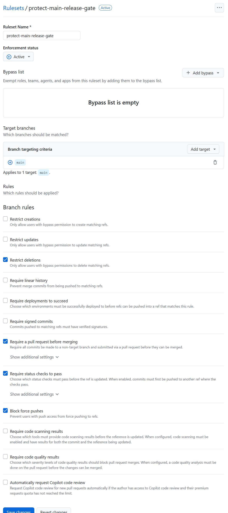

# Automation

## A - Overview

This section documents the automation and CI/CD process of the project.

The goal is to ensure a controlled and reproducible workflow for development, testing, and releases. Automation is primarily enforced on the remote (GitHub) side to guarantee consistent rules and prevent invalid releases.  

!!! caution
    Currently implemented:
    - CI Main Check (Release Gate)

## B - CI Main Check (Release Gate)

### 1. Goal

The CI Main Check acts as a mandatory release gate for the `main` branch.

Its purpose is to ensure that:

- no direct changes are merged into `main`
- all changes go through a pull request
- only `release/*` branches are allowed to target `main`
- all required checks must pass before a merge is possible

!!! caution
     This enforces a clear separation between development (`dev`) and stable releases (`main`). The validation is performed on GitHub (remote), making the rules consistent and non-bypassable in normal workflows.


### 2. Workflow

!!! done "Workflow"
    1. Development happens on the `dev` branch or derived `feature` branches.
    2. When a release is prepared, a `release/*` branch is created from `dev`.
    3. The release branch is pushed to GitHub.
    4. A pull request (**PR**) is opened:
       - base: `main`
       - compare: `release/*`
    5. The CI Main Check is triggered automatically.
    6. The Workflow validates:
       - the source branch name (`release/*`)
       - the defined status checks
    7. If the check fails:
       - the pull request cannot be merged
    8. If the check passes:
       - the pull request can be merged into `main`

### 3. Branch Rules

!!! caution 
    - `main` is a protected branch.
    - Merges into `main` are only allowed via pull request
    - The required CI check must pass before a merge is possible
    - Only branches matching `release/*` are allowed to merge into `main`
    - Pull requests from other branches (for example `dev`, ..., `bugfix/*`) are rejected by the CI Main Check

### 4. GitHub Ruleset

The `main` branch is protected using a GitHub ruleset to enforce the release policy. The ruleset enforces the defined workflow and prevents bypassing the CI validation.

**Branch protection / ruleset configuration:**


!!! caution Effect
    - ❌ failing check -> merge blocked
    - ⚠️ missing check -> merge blocked
    - ✅ successful check -> merge allowed
  
!!! note
    The ruleset acts as the final enforcement layer. Even if local workflows are bypassed, the merge into `main` is controlled on GitHub.

### 5. GitHub Actions

GitHub Actions is used to automate the validation process for pull requests targeting the `main` branch. The CI workflow is defined in the repository and executed on GitHub (remote).

!!! caution
    **Key characteristics:**
    - Trigger: **PR** -> `main`
    - Execution environment: GitHub-hosted runner (`ubuntu-latest`)
    - Validation logic:
      - checks the source branch (`release/*`)
      - executes defined CI steps
    - Result: 
      - ✅ success -> merge allowed
      - ❌ failure -> merge blocked
  


### 6. Repo Structure

The CI configuration is part of the repository and follows the standard GitHub layout for workflows.

```bash
.../project/
    |__.github/
        |__workflows/
            |__ci-main.yml
```

!!! caution
    All GitHub Actions workflows must be located inside the `.github/workflows/` directory to be detected and executed by GitHub.

### 7. Workflow file

The CI logic is defined in the workflow file:

```bash
.github/workflows/ci-main.yml
```

This file contains the configuration for "CI Main Check".

!!! caution "Core Elements"
    - **Name:** CI Main Check
    - **Trigger:** pull request targeting `main`
    - **Job:** `ci-check`
    - **Runner:** `ubuntu-latest`

!!! caution "Validation logic (simplified)"
    ```bash
    if source branch does not match release/*:
        fail the check
    else:
        pass
    ```
!!! note 
    The file is minimal at this stage. Add. checks added later!


### 8. Test Cases

The CI Main Check was validated with two test scenarios:

!!! note "PASS"
    **Valid case (should pass):**
    - Source branch: `release/test-ci`
    - Result: Check passed successfully
    - Merge allowed

!!! bug "FAIL"
    **Invalid case (should fail):**
    - Source branch: `test/wrong-branch`
    - Result: Check failed
    - Merge blocked by required status check

### 9. Screenshots

**Successful check (release branch):**


**Failed check (wrong brach):**


### 10. Summary

The CI Main Check enforces a strict release policy for the `main` branch.

All changes must go through a pull request and pass the required checks before being merged.  
Only `release/*` branches are allowed to target `main`, ensuring a controlled and predictable release process.

By enforcing the validation on GitHub, the release workflow is consistent and cannot be bypassed through local operations.

---

## C - Doku Build

---

## D - Pages Deploy

---

## E - Release Workflow

---

## F - Package / Docker Build

