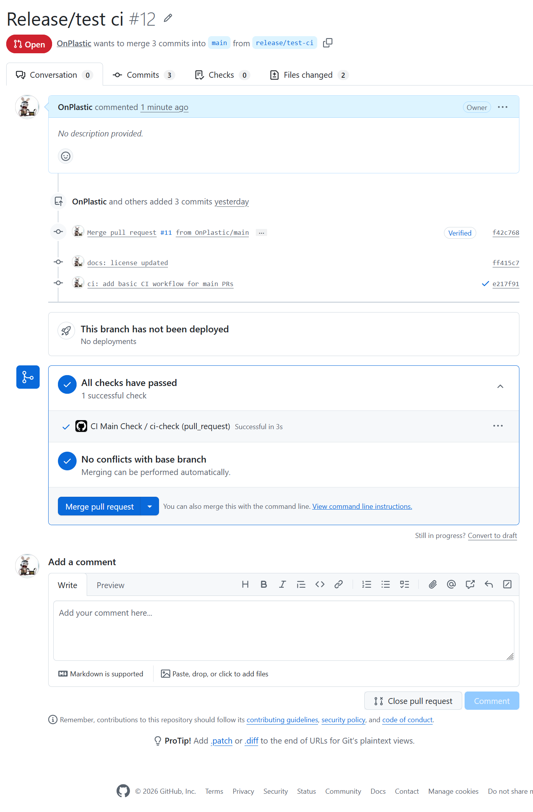
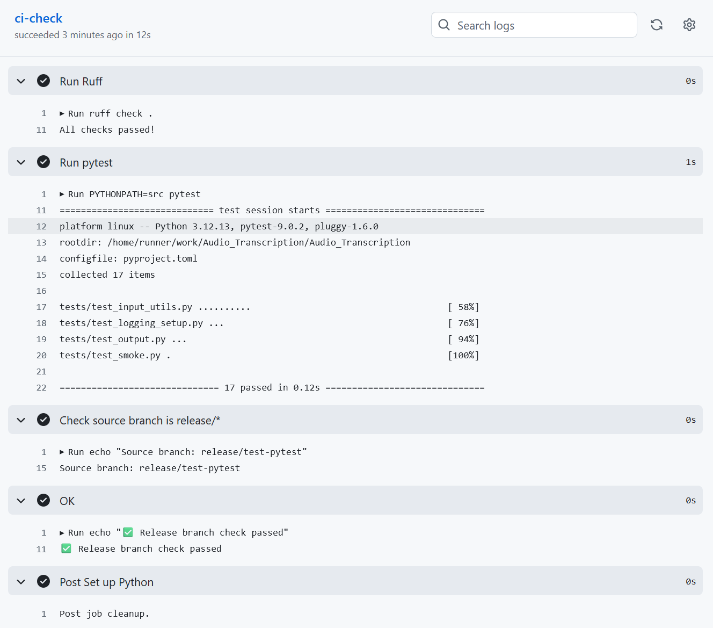
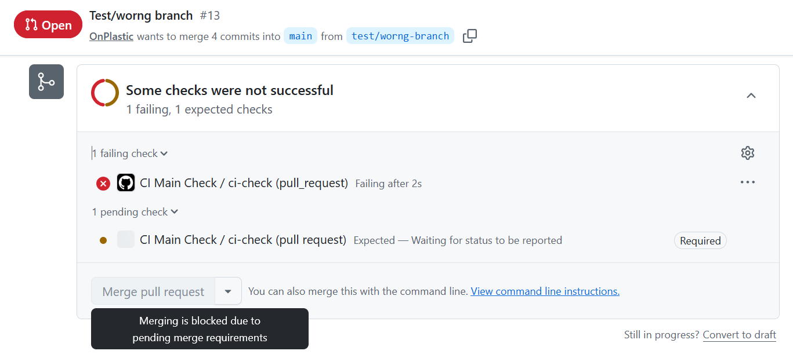

# Automation

## A - Overview

This section documents the automation and CI/CD process of the project.

The goal is to ensure a controlled and reproducible workflow for development, testing, and releases. Automation is primarily enforced on the remote (GitHub) side to guarantee consistent rules and prevent invalid releases.  

>[!WARNING] Currently implemented:
> - CI Main Check (Release Gate)
> - Ruff linting integrated into CI workflow
> - pytest integration into CI workflow
> - Docs Build Check 
> - Pages Deploy

## B - CI Main Check (Release Gate)

### 1. Goal

The CI Main Check acts as a mandatory release gate for the `main` branch.

Its purpose is to ensure that:

- no direct changes are merged into `main`
- all changes go through a pull request
- only `release/*` branches are allowed to target `main`
- all required checks must pass before a merge is possible

> [!WARNING] Separation
> This enforces a clear separation between development (`dev`) and stable releases (`main`). The validation is performed on GitHub (remote), making the rules consistent and non-bypassable in normal workflows.

### 2. Workflow

> [!TIP] Processes
> 1. Development happens on the `dev` branch or derived `feature` branches.
> 2. When a release is prepared, a `release/*` branch is created from `dev`.
> 3. The release branch is pushed to GitHub.
> 4. A pull request (**PR**) is opened:
>    - base: `main`
>    - compare: `release/*`
> 5. The CI `main` Check is triggered automatically.
> 6. The Workflow validates:
>    - the source branch name (`release/*`)
>    - code quality (Ruff)
>    - test execution (pytest)
>    - documentation build (pdoc)
>    - the defined status checks
> 7. If the check fails:
>    - the pull request cannot be merged
> 8. If the check passes:
>    - the pull request can be merged into `main`
> 9. With click on **merge pull request** the generated documentation will be deployed  

> [!NOTE]
> The automation system consists of multiple workflows (CI Check, Docs Build, and others), which are all executed as part of the same release validation process.

### 3. Branch Rules

> [!WARNING] Definitions
> - `main` is a protected branch.
> - Merges into `main` are only allowed via pull request
> - The required CI check must pass before a merge is possible
> - Only branches matching `release/*` are allowed to merge into `main`
> - Pull requests from other branches (for example `dev`, ..., `bugfix/*`) are rejected by the CI Main Check

### 4. GitHub Ruleset

The `main` branch uses a GitHub ruleset to enforce the release policy. The ruleset enforces the defined workflow and prevents bypassing the CI validation.

**Branch protection / ruleset configuration:**


> [!WARNING] Effect
> - ❌ failing check -> merge blocked
> - ⚠️ missing check -> merge blocked
> - ✅ successful check -> merge allowed
  
> [!NOTE]
> The ruleset acts as the final enforcement layer. Even if local workflows are bypassed, the merge into `main` is controlled on GitHub.

### 5. GitHub Actions

GitHub Actions is used to automate the validation process for pull requests targeting the `main` branch. The workflows are defined in the repository and executed on GitHub (remote).

> [!WARNING] Key characteristics
> - Trigger: **PR** -> `main`
> - Execution environment: GitHub-hosted runner (`ubuntu-latest`)
>    - Validation logic:
>      - runs Ruff linting (`ruff check .`)
>      - runs tests using pytest (`PYTHONPATH=src pytest`)
>      - builds the documentation using `pdoc`
>      - checks the source branch (`release/*`)
>      - executes defined CI steps
>    - Result: 
>      - ✅ success -> merge allowed
>      - ❌ failure -> merge blocked
> - Trigger: merge **PR** -> `main`
>    - commits generated documentation ( docs/api )
>    - updates GitHub Pages automatically

> [!NOTE]
> The workflows run with the state of the pull request branch itself. This means any changes are automatically tested as part of that pull request.

### 6. Repo File Structure

The CI configuration is part of the repository and follows the standard GitHub layout for workflows.

```bash
.../project/
    |__.github/
        |__workflows/
            |__ci-main.yml
            |__docs-main.yml
            |__pages-main.yml
```

> [!NOTE]
> All GitHub Actions workflows must be located inside the `.github/workflows/` directory to be detected and executed by GitHub.

### 7. Workflow files

These files define the automation logic for the different validation steps.

> [!WARNING] Core Elements
> - **Name:** CI Main Check, Docs Build Check
> - **Trigger:** pull request targeting `main`
> - **Job:** `ci-check`, `docs-build`
> - **Runner:** `ubuntu-latest`

> [!WARNING] Validation logic (simplified)
> ```bash
>    # CI Main Check
>    run ruff check .
>    run PYTHONPATH=src pytest
>
>    # Docs Build Check
>    run pdoc -o docs/api
>
>    # Pages Deploy
>    run pdoc ...
>    commit docs/api
>    push changes to main
>
>    if source branch does not match release/*:
>        fail the check
>    else:
>        continue with the workflow
> ```

> [!NOTE] 
> The files are minimal at this stage. Additional checks can be added later!


### 8. Test Cases

The CI Main Check was validated with two test scenarios:

> [!NOTE] PASS
> **Valid case (should pass):**
> - Source branch: `release/test-ci`
> - Result: Check passed successfully
> - Merge allowed

> [!CAUTION] FAIL
>     **Invalid case (should fail):**
> - Source branch: `test/wrong-branch`
> - Result: Check failed
> - Merge blocked by required status check

### 9. Screenshots

**Successful check (release branch):**


**`ci-check` Validation/Checks passed:**


**Failed check (wrong branch):**



## C - Summary

The **CI-automation-process** enforces a strict release policy for the `main` branch.

All changes must go through a pull request and pass the defined checks before being merged.  
Only `release/*` branches are allowed to target `main`, ensuring a controlled and predictable release process.

> [!WARNING] The CI workflows includes
> - automated linting using Ruff  
> - automated testing using pytest  
> - automated API documentation using pdoc
> - automated deployment of API documentation via GitHub Pages
>        
> By enforcing the validation on GitHub, the release workflow is consistent and cannot be bypassed through local operations.

---

